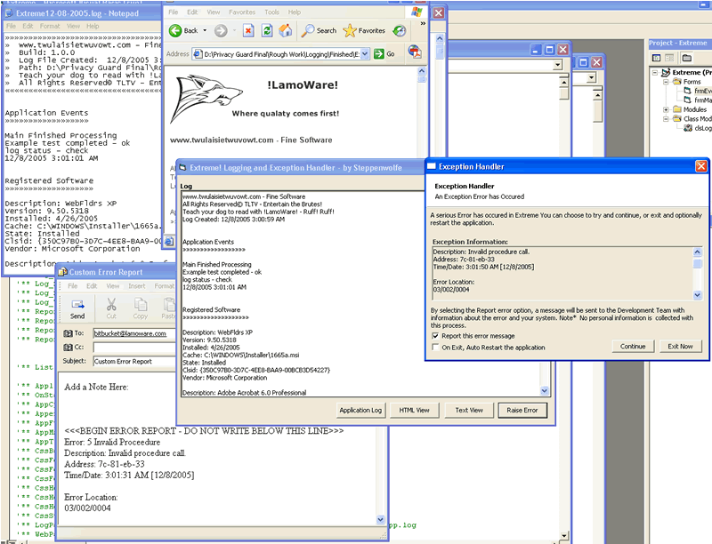



## Extreme\! 1\.3 \- Updated\!  Event Logging and GPF Interceptor Class

### Description

The Ultimate Application Logging and Error Handling Interface!! Adds professional error handling to any application with just a few simple settings.

Every developer who ever plans to publish his code could use this class. Error and application monitoring adds a layer of professionalism to your application, while saving you endless hours of misery dealing with vague end-user issues..

The Application logging interface logs desired events and status information and combines this with a powerful WMI interface that delivers rich and professional logging features.

The event logging system catches every unhandled error, with options to resume or invoke a user dialog. Events are logged in complete detail - error number, context dump, custom messages for every known vb error, even the specific location in a module is tracked and recorded. Options include auto generated email error reports that will work with any email client, auto application restart, HTML report view, .txt logs and textbox view, and many other features and granular, well documented controls..

----

Updated ver 1.1

Extended properties for more flexibility. Added wmi test on class init, optional hard paths and check for logs, and fixed some small issues.

Added css style properties to embed style elements on web report page.

----

Another small update - found some small problems when testing each property, project has been updated with changes..

----

1.3 is up.. added some fixes for gpf handler

Cheers

John
 
### More Info
 

             |
---                |---
**Submitted On**   |2006-01-09 20:11:22
**By**             |[Steppenwolfe](https://github.com/Planet-Source-Code/PSCIndex/blob/master/ByAuthor/steppenwolfe.md)
**Level**          |Intermediate
**User Rating**    |5.0 (165 globes from 33 users)
**Compatibility**  |VB 5\.0, VB 6\.0
**Category**       |[Complete Applications](https://github.com/Planet-Source-Code/PSCIndex/blob/master/ByCategory/complete-applications__1-27.md)
**World**          |[Visual Basic](https://github.com/Planet-Source-Code/PSCIndex/blob/master/ByWorld/visual-basic.md)
**Archive File**   |[Extreme\!\_1196393192006\.zip](https://github.com/Planet-Source-Code/steppenwolfe-extreme-1-3-updated-event-logging-and-gpf-interceptor-class__1-63541/archive/master.zip)

